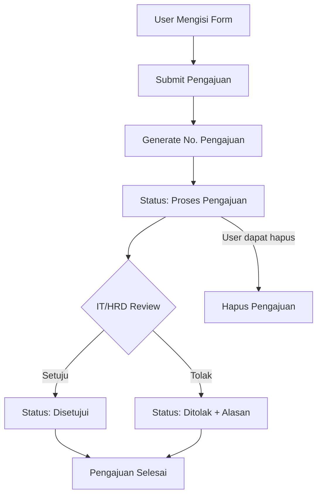

# Panduan Sistem Pengajuan Tukar Dinas

## Deskripsi Sistem

Sistem Pengajuan Tukar Dinas adalah fitur yang memungkinkan pegawai untuk mengajukan pertukaran jadwal dinas/shift dengan pegawai lain. Sistem ini dirancang untuk memfasilitasi fleksibilitas jadwal kerja dengan tetap menjaga kontrol administratif.

## Fitur Utama

### 1. **Pengajuan Tukar Dinas**

- Form pengajuan yang lengkap dan user-friendly
- Validasi data otomatis
- Generate nomor pengajuan otomatis dengan format `TD-YYYY-MM-NNNN`
- Modal form yang responsive untuk desktop dan mobile

### 2. **Manajemen Status**

- **Proses Pengajuan**: Status awal setelah pengajuan dibuat
- **Disetujui**: Pengajuan telah disetujui oleh IT/HRD
- **Ditolak**: Pengajuan ditolak dengan alasan yang jelas

### 3. **Role-Based Access Control**

- **User Biasa**: Dapat membuat dan melihat pengajuan sendiri
- **IT/HRD**: Dapat melihat semua pengajuan dan mengubah status
- **Semua Role**: Dapat menghapus pengajuan dengan status "Proses Pengajuan"

### 4. **Interface Responsive**

- **Desktop**: Tabel lengkap dengan semua informasi
- **Mobile**: Card layout yang mudah dibaca dan digunakan
- **Modal**: Dialog yang dapat di-scroll untuk mobile

## Struktur Database

### Tabel: `pengajuan_tudin`

```sql
CREATE TABLE pengajuan_tudin (
  id int(11) NOT NULL AUTO_INCREMENT,
  no_pengajuan varchar(20) NOT NULL,           -- Format: TD-YYYY-MM-NNNN
  tanggal date NOT NULL,                       -- Tanggal pengajuan
  nik varchar(20) NOT NULL,                    -- NIK pemohon
  tgl_dinas date NOT NULL,                     -- Tanggal dinas yang akan ditukar
  shift1 enum('Pagi','Siang','Malam') NOT NULL, -- Shift pemohon
  nik_ganti varchar(20) NOT NULL,              -- NIK pegawai pengganti
  tgl_ganti date NOT NULL,                     -- Tanggal dinas pengganti
  shift2 enum('Pagi','Siang','Malam') NOT NULL, -- Shift pengganti
  nik_pj varchar(20) DEFAULT NULL,             -- NIK penanggung jawab (opsional)
  keptingan varchar(100) NOT NULL,             -- Kepentingan/alasan tukar dinas
  status enum('Proses Pengajuan','Disetujui','Ditolak') DEFAULT 'Proses Pengajuan',
  alasan_ditolak text DEFAULT NULL,            -- Alasan penolakan jika ditolak
  created_at timestamp DEFAULT CURRENT_TIMESTAMP,
  updated_at timestamp DEFAULT CURRENT_TIMESTAMP ON UPDATE CURRENT_TIMESTAMP,
  PRIMARY KEY (id),
  UNIQUE KEY no_pengajuan (no_pengajuan)
);
```

## API Endpoints

### 1. **GET /api/pengajuan-tukar-dinas**

**Deskripsi**: Mengambil data pengajuan tukar dinas
**Authorization**: Required (JWT Token)
**Response**:

```json
{
	"status": 200,
	"message": "Data pengajuan tukar dinas berhasil diambil",
	"data": [
		{
			"id": 1,
			"no_pengajuan": "TD-2024-01-0001",
			"tanggal": "2024-01-15",
			"nik": "12345",
			"tgl_dinas": "2024-01-20",
			"shift1": "Pagi",
			"nik_ganti": "67890",
			"tgl_ganti": "2024-01-22",
			"shift2": "Siang",
			"nik_pj": "11111",
			"keptingan": "Keperluan keluarga",
			"status": "Proses Pengajuan",
			"alasan_ditolak": null,
			"created_at": "2024-01-15T10:00:00.000Z",
			"updated_at": "2024-01-15T10:00:00.000Z"
		}
	]
}
```

### 2. **POST /api/pengajuan-tukar-dinas**

**Deskripsi**: Membuat pengajuan tukar dinas baru
**Authorization**: Required (JWT Token)
**Request Body**:

```json
{
	"tanggal": "2024-01-15",
	"tgl_dinas": "2024-01-20",
	"shift1": "Pagi",
	"nik_ganti": "67890",
	"tgl_ganti": "2024-01-22",
	"shift2": "Siang",
	"nik_pj": "11111",
	"keptingan": "Keperluan keluarga"
}
```

### 3. **PUT /api/pengajuan-tukar-dinas**

**Deskripsi**: Update status pengajuan (IT/HRD only)
**Authorization**: Required (JWT Token + IT/HRD Role)
**Request Body**:

```json
{
	"id": 1,
	"status": "Disetujui",
	"alasan_ditolak": null
}
```

### 4. **DELETE /api/pengajuan-tukar-dinas**

**Deskripsi**: Hapus pengajuan (status Proses Pengajuan only)
**Authorization**: Required (JWT Token)
**Request Body**:

```json
{
	"id": 1
}
```

## Komponen Frontend

### 1. **Halaman Utama**: `/dashboard/pengajuan-tukar-dinas`

- **File**: `src/app/dashboard/pengajuan-tukar-dinas/page.js`
- **Fitur**:
  - Form pengajuan dalam modal
  - Tabel data untuk desktop
  - Card layout untuk mobile
  - Filter berdasarkan role user
  - CRUD operations lengkap

### 2. **Komponen Modal**

- **Form Pengajuan**: Modal dengan form lengkap dan validasi
- **Detail Pengajuan**: Modal untuk melihat detail lengkap
- **Update Status**: Modal untuk IT/HRD mengubah status
- **Konfirmasi Hapus**: Modal konfirmasi dengan warning

## Fitur Keamanan

### 1. **Authentication & Authorization**

- JWT Token validation pada setiap request
- Role-based access control (User vs IT/HRD)
- User hanya bisa melihat pengajuan sendiri (kecuali IT/HRD)

### 2. **Data Validation**

- Server-side validation untuk semua input
- Client-side validation untuk UX yang baik
- Sanitization untuk mencegah injection attacks

### 3. **Business Logic Protection**

- Hanya pengajuan dengan status "Proses Pengajuan" yang bisa dihapus
- IT/HRD required untuk update status
- Validasi keberadaan pegawai pengganti dan PJ

## Workflow Pengajuan



## Format Nomor Pengajuan

**Format**: `TD-YYYY-MM-NNNN`

- **TD**: Prefix untuk Tukar Dinas
- **YYYY**: Tahun (4 digit)
- **MM**: Bulan (2 digit dengan leading zero)
- **NNNN**: Sequence number (4 digit dengan leading zero, reset setiap bulan)

**Contoh**: `TD-2024-01-0001`, `TD-2024-01-0002`, `TD-2024-02-0001`

## Penggunaan

### 1. **Membuat Pengajuan Baru**

1. Klik tombol "Ajukan Tukar Dinas"
2. Isi form dengan data yang diperlukan:
   - Tanggal pengajuan
   - Tanggal dan shift dinas yang akan ditukar
   - Pilih pegawai pengganti
   - Tanggal dan shift dinas pengganti
   - Pilih penanggung jawab (opsional)
   - Isi alasan/kepentingan
3. Klik "Submit Pengajuan"

### 2. **Melihat Detail Pengajuan**

1. Klik tombol "Lihat" pada baris pengajuan
2. Modal detail akan menampilkan informasi lengkap
3. IT/HRD dapat langsung edit status dari modal detail

### 3. **Mengubah Status (IT/HRD)**

1. Klik tombol "Edit" pada pengajuan
2. Pilih status baru (Proses Pengajuan/Disetujui/Ditolak)
3. Jika ditolak, wajib isi alasan penolakan
4. Klik "Update Status"

### 4. **Menghapus Pengajuan**

1. Hanya pengajuan dengan status "Proses Pengajuan" yang bisa dihapus
2. Klik tombol hapus (ikon trash)
3. Konfirmasi penghapusan di modal
4. Klik "Ya, Hapus"

## Responsive Design

### Desktop (≥768px)

- Sidebar navigation
- Tabel lengkap dengan semua kolom
- Modal dengan layout 2 kolom
- Hover effects dan tooltips

### Mobile (<768px)

- Bottom navigation
- Card layout dengan informasi tersusun vertikal
- Modal full-screen dengan scroll
- Touch-friendly buttons

## Error Handling

### 1. **Client-side**

- Form validation dengan feedback real-time
- Loading states untuk semua async operations
- Toast notifications untuk success/error messages
- Network error handling dengan retry options

### 2. **Server-side**

- Comprehensive input validation
- Database constraint violations handling
- Authentication/authorization error responses
- Proper HTTP status codes

## Performance Optimizations

### 1. **Frontend**

- React state management yang efisien
- Conditional rendering untuk role-based UI
- Optimized re-renders dengan proper dependency arrays
- Image lazy loading untuk avatar pegawai

### 2. **Backend**

- Database indexing untuk query optimization
- Prepared statements untuk security dan performance
- Connection pooling untuk database connections
- Caching untuk data pegawai yang sering diakses

## Monitoring & Logging

### 1. **Application Logs**

- User actions (create, update, delete)
- Authentication attempts
- Authorization failures
- System errors dengan stack traces

### 2. **Database Logs**

- Query performance monitoring
- Slow query detection
- Connection pool statistics
- Transaction rollback tracking

## Maintenance

### 1. **Regular Tasks**

- Database backup dan cleanup
- Log rotation dan archiving
- Performance monitoring
- Security updates

### 2. **Periodic Reviews**

- User feedback analysis
- Performance metrics review
- Security audit
- Feature usage statistics

## Troubleshooting

### 1. **Common Issues**

- **Pengajuan tidak muncul**: Cek role user dan permission
- **Form tidak bisa submit**: Validasi field yang kosong
- **Status tidak bisa diubah**: Pastikan user adalah IT/HRD
- **Nomor pengajuan duplikat**: Cek database constraint dan function

### 2. **Debug Mode**

- Enable console logging di browser developer tools
- Check network tab untuk API response errors
- Verify JWT token validity
- Check database connection dan query logs

## Future Enhancements

### 1. **Planned Features**

- Email notifications untuk status changes
- Calendar integration untuk visualisasi shift
- Bulk approval untuk IT/HRD
- Reporting dan analytics dashboard
- Mobile app dengan push notifications

### 2. **Technical Improvements**

- Real-time updates dengan WebSocket
- Advanced caching dengan Redis
- API rate limiting
- Automated testing suite
- CI/CD pipeline integration

---

**Dibuat**: 2024
**Versi**: 1.0
**Tim Pengembang**: SDM Development Team
