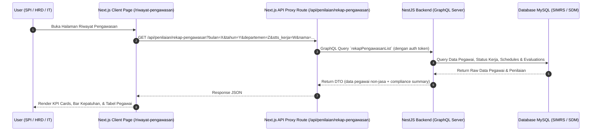

# Spec: Menu Riwayat Penilaian Kinerja (Pengawasan / HRD)

**Date:** 2026-08-05  
**Author:** Antigravity AI  
**Status:** Approved by User  

---

## 1. Overview & Goal

Membuat menu/halaman baru **Riwayat Penilaian (Pengawasan / HRD)** di bawah modul **Penilaian Kinerja** (`/dashboard/penilaian-kinerja/riwayat-pengawasan`).  
Halaman ini khusus ditujukan bagi bagian Pengawasan (SPI), HRD (SDM), dan IT untuk memantau rekapitulasi penilaian kinerja seluruh pegawai rumah sakit/perusahaan tanpa dibatasi oleh hirarki tim supervisor.

### Key Requirements:
1. **Separation of Concerns**: Terisolasi penuh dari kalkulasi jasa/insentif/keuangan.
2. **Non-Jasa Metrics Only**: Menghapus seluruh kolom, statistik summary, dan detail yang berhubungan dengan nominal jasa/keuangan (Jasa Dasar, Pengurang Jasa, Jasa Tambahan, Jasa Final).
3. **Compliance Monitoring**: Menampilkan indikator kepatuhan (*Compliance Rate*) penyelesaian penilaian (persentase rekap yang sudah `LOCKED` disetujui supervisor per unit/institusi).
4. **Status Kerja Filtering**: Menambahkan filter `stts_kerja` (PNS, PPPK, Kontrak, Tetap, Honorer, dll.) yang diambil dari database/API `/api/stts-kerja`.
5. **Backend NestJS Architecture**: Data diproses oleh backend NestJS GraphQL (`website/backend`) via resolver & service terpisah (`rekap-pengawasan`).
6. **Dynamic Menu Integration**: Hak akses halaman dikendalikan melalui konfigurasi menu dinamis GraphQL DB (`fetchMyMenus`).

---

## 2. Architecture & Data Flow



---

## 3. NestJS Backend Specifications (`website/backend`)

### 3.1 DTO Types (`src/sdm/dto/rekap-pengawasan-types.ts`)
```typescript
import { Field, Float, Int, ObjectType } from '@nestjs/graphql';
import { PaginationMetaDto } from '../../common/dto/pagination.dto';

@ObjectType()
export class RekapPengawasanDto {
  @Field(() => Int, { nullable: true })
  id?: number;

  @Field(() => Int)
  pegawai_id: number;

  @Field(() => String, { nullable: true })
  nik?: string;

  @Field(() => String, { nullable: true })
  nama?: string;

  @Field(() => String, { nullable: true })
  nama_departemen?: string;

  @Field(() => String, { nullable: true })
  stts_kerja?: string;

  @Field(() => Int)
  bulan: number;

  @Field(() => Int)
  tahun: number;

  @Field(() => Int)
  total_hari_jadwal: number;

  @Field(() => Int)
  hari_approved: number;

  @Field(() => Int)
  hari_approved_bonus: number;

  @Field(() => Int)
  gap_hari: number;

  @Field(() => Float)
  rata_skor_total: number;

  @Field(() => String)
  status_rekap: string; // 'draft' | 'final' | 'LOCKED'
}

@ObjectType()
export class RekapPengawasanSummaryDto {
  @Field(() => Int)
  totalEmployees: number;

  @Field(() => Float)
  avgMonthlyScore: number;

  @Field(() => Int)
  totalLocked: number;

  @Field(() => Int)
  totalDraft: number;

  @Field(() => Float)
  compliancePercentage: number; // (totalLocked / totalEmployees) * 100
}

@ObjectType()
export class RekapPengawasanPaginationDto {
  @Field(() => [RekapPengawasanDto])
  data: RekapPengawasanDto[];

  @Field(() => PaginationMetaDto)
  meta: PaginationMetaDto;

  @Field(() => RekapPengawasanSummaryDto)
  summary: RekapPengawasanSummaryDto;
}
```

### 3.2 GraphQL Resolver (`src/sdm/rekap-pengawasan.resolver.ts`)
- Query Name: `rekapPengawasanList`
- Guards: `GqlJwtSdmGuard`, `GqlThrottlerGuard`
- Arguments:
  - `bulan` (Int!, required)
  - `tahun` (Int!, required)
  - `departemen` (String, default: 'ALL')
  - `sttsKerja` (String, default: 'ALL')
  - `nama` (String, default: '')
  - `page` (Int, default: 1)
  - `limit` (Int, default: 10)

### 3.3 Service & Repository (`src/sdm/rekap-pengawasan.service.ts`, `src/sdm/repositories/rekap-pengawasan.repository.ts`)
- Query seluruh data pegawai aktif dari tabel `pegawai` yang di-JOIN dengan `stts_kerja`, `departemen`, serta rekapitulasi penilaian/jadwal bulanan.
- Filter opsional berdasarkan `departemen`, `stts_kerja`, dan pencarian `nama`/`nik`.
- Kalkulasi statistik kepatuhan institusi: `totalEmployees`, `avgMonthlyScore`, `totalLocked`, `totalDraft`, `compliancePercentage`.

---

## 4. Next.js Frontend Specifications (`sdm`)

### 4.1 Page Component (`src/app/dashboard/penilaian-kinerja/riwayat-pengawasan/page.js`)
1. **Header**: "Riwayat Penilaian (Pengawasan / Audit SDM)".
2. **Summary Cards**:
   - Total Pegawai Terpantau
   - Rata-rata Skor Kinerja
   - Rekap Completed (LOCKED) vs DRAFT
   - Bar Kepatuhan Unit (% Compliance)
3. **Filter Controls**:
   - Periode Bulan (`MM`) & Tahun (`YYYY`)
   - Departemen Selector (Dropdown `/api/departemen`)
   - Status Kerja Selector (Dropdown `/api/stts-kerja`)
   - Search Name/NIK Input
4. **Data Table Columns**:
   - NIK
   - Nama Pegawai
   - Departemen
   - Status Kerja
   - Hari Jadwal
   - Hari Approved
   - Gap Hari
   - Rata-rata Skor Kinerja
   - Status Rekap (Badge `LOCKED` / `DRAFT`)
   - Aksi (Detail Slide-over)
5. **Slide-over Panel**:
   - Detail jadwal & evaluasi kegiatan harian pegawai terpilih (tanpa kolom/nominal jasa).

### 4.2 Next.js API Proxy (`src/app/api/penilaian/rekap-pengawasan/route.js`)
- Mengambil query params (`bulan`, `tahun`, `departemen`, `stts_kerja`, `nama`, `page`, `limit`).
- Memanggil GraphQL NestJS backend query `rekapPengawasanList` dengan membawa JWT Token pengguna.
- Mengembalikan response JSON ke frontend client.

---

## 5. Verification & Testing Plan

### Automated / API Verification:
- Verifikasi query GraphQL `rekapPengawasanList` pada backend NestJS mengembalikan data non-jasa dengan kriteria `sttsKerja` yang tepat.
- Verifikasi API Proxy Next.js `/api/penilaian/rekap-pengawasan` menangani error handling & unauthorized request.

### Manual UI Verification:
1. **Filter Status Kerja**: Memastikan dropdown Status Kerja memuat list dari `/api/stts-kerja` dan menyaring data tabel secara responsif.
2. **Compliance Rate**: Memastikan persentase kepatuhan terhitung dan tampil pada kartu summary.
3. **Exclusion of Financial Data**: Memastikan tidak ada teks/kolom/elemen nominal jasa yang tampil pada tabel utama maupun panel slide-over detail.
