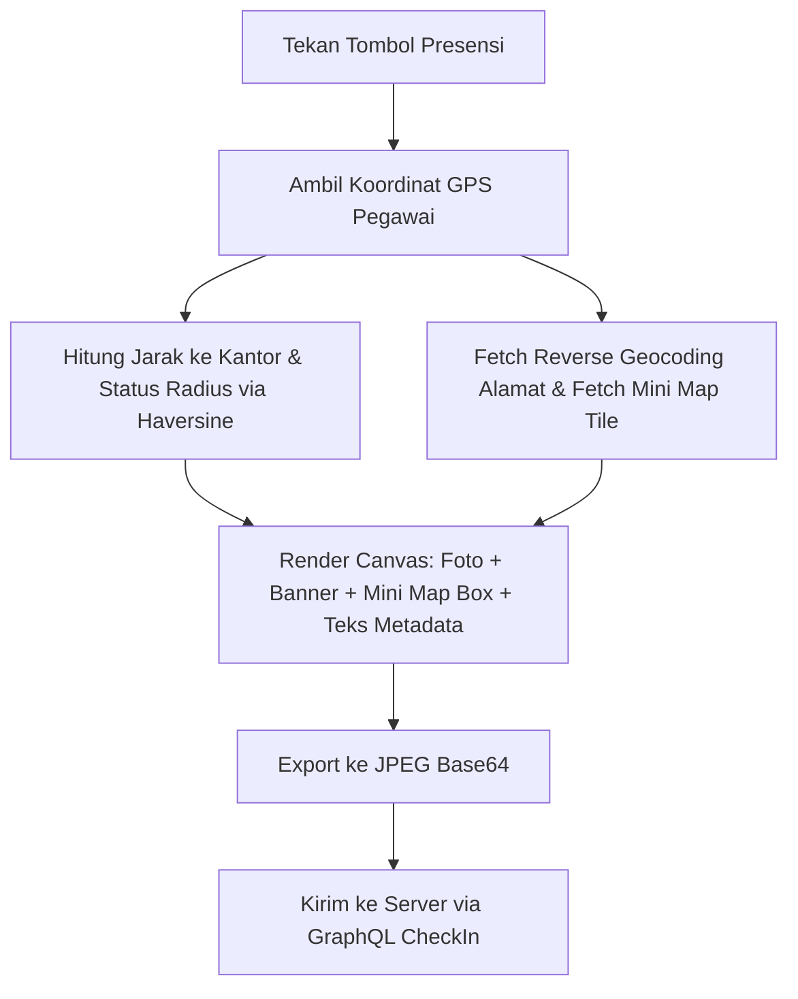

# Desain: Kalkulasi Jarak Kantor dan Mini Map Thumbnail pada Watermark Foto Presensi

**Tanggal:** 2026-08-20  
**Status:** Draft / Pending Review  
**Tujuan:** Menambahkan informasi jarak GPS ke kantor (`NEXT_PUBLIC_OFFICE_LAT`, `NEXT_PUBLIC_OFFICE_LNG`), status validitas radius (`NEXT_PUBLIC_ALLOWED_RADIUS`), dan *mini map thumbnail* visual (OpenStreetMap/CartoDB) pada banner watermark foto presensi.

---

## 1. Latar Belakang & Kebutuhan

1. Pada foto presensi pegawai yang telah memiliki watermark koordinat, diperlukan kejelasan visual mengenai seberapa jauh posisi pegawai terhadap titik kantor saat presensi diambil.
2. Parameter kantor yang digunakan berasal dari environment variables:
   - `NEXT_PUBLIC_OFFICE_LAT` (default: `-7.9797`)
   - `NEXT_PUBLIC_OFFICE_LNG` (default: `112.6304`)
   - `NEXT_PUBLIC_ALLOWED_RADIUS` (default: `500` meter)
3. Untuk tampilan yang lebih otentik menyerupai aplikasi *GPS Map Camera*, disematkan kotak peta statis mini (*mini map thumbnail*) gratis dari CartoDB/OpenStreetMap dengan pin lokasi di atasnya.

---

## 2. Spesifikasi Tampilan Watermark

Watermark dirender pada Canvas HTML5 di bagian bawah citra foto dengan struktur dua kolom:

```
┌─────────────────────────────────────────────────────────────┐
│                                                             │
│                       [ FOTO WAJAH ]                        │
│                                                             │
├──────────────┬──────────────────────────────────────────────┤
│ ┌──────────┐ │ 👤 [Nama Pegawai] (NIK: [NIK])               │
│ │  [MINI   │ │ 📍 [Alamat / Wilayah Reverse Geocode]        │
│ │   MAP    │ │ 🌐 Lat: [lat], Long: [long] (±[accuracy]m)   │
│ │  + PIN]  │ │ 📏 Jarak Kantor: [jarak] (Maks: [radius]m - [Status]) │
│ └──────────┘ │ 🕒 [Hari, DD MMMM YYYY, HH:mm:ss WIB]        │
└──────────────┴──────────────────────────────────────────────┘
```

### Elemen Visual:
- **Mini Map Thumbnail (Kolom Kiri Banner)**:
  - Ukuran: Kotak persegi ~80x80 px (disesuaikan dengan skala resolusi foto).
  - Tampilan: Tile peta raster resolusi tajam dengan sudut melengkung (*rounded corners* border 4px radius) dan pin marker berwarna merah di tengahnya.
  - Sumber: CartoDB Voyager raster tile / OpenStreetMap raster tile (gratis, tanpa API key, respons cepat, mendukung CORS).
  - Fallback: Jika offline atau tile gagal dimuat dalam 1.5 detik, kolom peta dilewati dan teks mengisi lebar penuh tanpa error.
- **Teks Metadata (Kolom Kanan Banner)**:
  - **Baris 1**: `👤 [Nama Pegawai] (NIK: [NIK])` (Bold, Putih `#FFFFFF`)
  - **Baris 2**: `📍 [Alamat Perkiraan]` (Regular, Putih-Abu `#E2E8F0`)
  - **Baris 3**: `🌐 Lat: -7.561234, Long: 110.823456 (±8m)` (Monospace, Cyan `#38BDF8`)
  - **Baris 4 (Baru)**: `📏 Jarak Kantor: 45m (Radius: 500m - Valid)` (Semibold, Emerald `#34D399` jika dalam radius, atau Rose `#F87171` jika di luar area)
  - **Baris 5**: `🕒 [Hari, Tanggal & Jam WIB]` (Semibold, Kuning Muda `#FEF08A`)

---

## 3. Detail Perhitungan Jarak (Haversine Formula)

Jarak dihitung secara matematis menggunakan rumus Haversine di client side:

$$\Delta\phi = \frac{(\text{lat}_2 - \text{lat}_1) \times \pi}{180}, \quad \Delta\lambda = \frac{(\text{lon}_2 - \text{lon}_1) \times \pi}{180}$$
$$a = \sin^2\left(\frac{\Delta\phi}{2}\right) + \cos\left(\frac{\text{lat}_1 \times \pi}{180}\right) \cos\left(\frac{\text{lat}_2 \times \pi}{180}\right) \sin^2\left(\frac{\Delta\lambda}{2}\right)$$
$$c = 2 \times \text{atan2}(\sqrt{a}, \sqrt{1-a}), \quad \text{distance} = 6371000 \times c \quad (\text{meter})$$

- Format tampilan:
  - Jika $\text{distance} < 1000\text{ m}$: `[Math.round(distance)]m`
  - Jika $\text{distance} \ge 1000\text{ m}$: `[(distance / 1000).toFixed(2)]km`
- Evaluasi Status Radius:
  - Jika $\text{distance} \le \text{allowedRadius}$: `Valid` (Teks Emerald)
  - Jika $\text{distance} > \text{allowedRadius}$: `Di Luar Area` (Teks Rose)

---

## 4. Alur Kerja Teknis



### 4.1 Tile Calculation & Map Fetcher (`src/utils/geoHelper.js`)
- Menambahkan fungsi `fetchMiniMapTile(latitude, longitude, zoom = 16)`:
  - Mengonversi `(lat, lng)` ke nomor tile `(x, y)` pada zoom 16.
  - Memuat citra tile dari `https://basemaps.cartocdn.com/rastertiles/voyager/{z}/{x}/{y}.png`.
  - Dilengkapi timeout 1500ms dan penanganan CORS `img.crossOrigin = "anonymous"`.
  - Mengembalikan `HTMLImageElement` yang siap digambar ke Canvas.

### 4.2 Canvas Watermark Stamping (`src/utils/imageOptimizer.js`)
- Memperbarui `stampGpsWatermark(dataUrl, metadata)`:
  - Menerima `metadata: { ..., distanceInfo, mapImage }`.
  - Jika `mapImage` tersedia, menggambar kotak peta persegi di sebelah kiri banner dengan rounded clipping dan menggambar pin lokasi merah di tengahnya.
  - Menghitung koordinat teks di sebelah kanan kotak peta.
  - Menambahkan baris jarak kantor dengan warna dinamis sesuai status radius.

### 4.3 Integrasi Halaman Presensi (`src/app/dashboard/attendance/page.js`)
- Mengambil nilai `NEXT_PUBLIC_OFFICE_LAT`, `NEXT_PUBLIC_OFFICE_LNG`, `NEXT_PUBLIC_ALLOWED_RADIUS`.
- Menghitung `distance` dan `isWithinRadius`.
- Memanggil `fetchMiniMapTile(lat, lng)` secara asinkron paralel dengan `getReverseGeocode(lat, lng)`.
- Mengirimkan `distanceInfo` dan `mapImage` ke `capturePhoto`.

---

## 5. Rencana Perubahan Berkas

| No | Berkas | Aksi | Deskripsi Perubahan |
|---|---|---|---|
| 1 | `src/utils/geoHelper.js` | **MODIFY** | Tambah `calculateDistance`, `formatDistance`, `latLonToTile`, dan `fetchMiniMapTile`. |
| 2 | `src/utils/imageOptimizer.js` | **MODIFY** | Update `stampGpsWatermark` untuk merender mini map thumbnail + baris jarak & radius. |
| 3 | `src/components/AttendanceCamera.jsx` | **MODIFY** | Pastikan `capturePhoto(watermarkMetadata)` meneruskan data peta & jarak. |
| 4 | `src/app/dashboard/attendance/page.js` | **MODIFY** | Sediakan data jarak kantor & peta mini saat presensi masuk. |

---

## 6. Rencana Verifikasi & Pengujian

1. **Pengujian Kalkulasi Jarak**:
   - Uji presensi dengan posisi GPS: pastikan jarak yang tercantum akurat terhadap koordinat kantor dan label `Valid` / `Di Luar Area` sesuai nilai `NEXT_PUBLIC_ALLOWED_RADIUS`.
2. **Pengujian Mini Map Thumbnail**:
   - Pastikan kotak peta mini muncul rapi di kiri banner dengan pin merah di tengahnya.
   - Uji skenario offline / timeout: pastikan presensi tetap berjalan mulus dengan layout teks penuh jika peta gagal dimuat.
3. **Pengujian Build**:
   - Jalankan `npm run build` untuk memverifikasi tidak ada error kompilasi.
