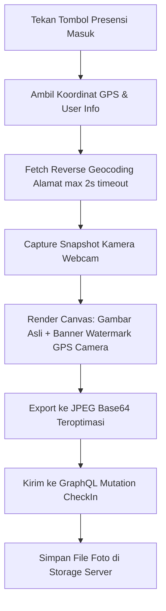

# Desain: Watermark Geolocation GPS Camera pada Foto Presensi Pegawai

**Tanggal:** 2026-08-20  
**Status:** Draft / Pending Review  
**Tujuan:** Menambahkan watermark metadata geolocation dan waktu ala *GPS Map Camera* langsung ke dalam file foto presensi masuk pegawai secara permanen melalui HTML5 Canvas rendering di sisi client sebelum diunggah ke server.

---

## 1. Latar Belakang & Kebutuhan

Pada proses presensi masuk pegawai:
1. Saat ini foto yang diambil dari kamera hanya berupa citra wajah mentah tanpa cap visual (*visual stamp*) lokasi maupun waktu.
2. Untuk meningkatkan validitas, transparansi audit, dan keaslian bukti kehadiran (anti-fraud), diperlukan watermark tersemat permanen pada foto yang memuat:
   - Nama Pegawai & NIK
   - Alamat Perkiraan Hasil Reverse Geocoding (Jalan / Kelurahan / Kota)
   - Koordinat Geolocation Presisi (Latitude & Longitude) beserta Akurasi GPS (± meter)
   - Tanggal dan Jam Realtime Presensi (WIB)

---

## 2. Spesifikasi Tampilan & Tata Letak Watermark

Watermark dirender pada bagian bawah foto menggunakan HTML5 Canvas dengan spesifikasi:
- **Background Banner:** Strip hitam transparan (`rgba(0, 0, 0, 0.72)`) di bagian bawah citra setinggi ~22%–28% dari tinggi foto.
- **Warna Teks & Tipografi:**
  - Font keluarga sans-serif (*Inter, Roboto, Arial*) dengan *crisp anti-aliasing* dan *drop shadow* tipis (`rgba(0, 0, 0, 0.9)`).
  - Teks Putih (`#FFFFFF`) untuk data utama, Aksen Cyan/Kuning Keemasan (`#38BDF8` / `#FCD34D`) untuk koordinat dan label.
- **Susunan Baris:**
  1. **Baris 1 (Pegawai):** `👤 [Nama Pegawai] (NIK: [NIK])` (Font Bold)
  2. **Baris 2 (Alamat):** `📍 [Alamat / Jalan / Wilayah hasil reverse geocoding]` (Font Regular, wrap max 2 baris jika panjang)
  3. **Baris 3 (Koordinat GPS):** `🌐 Lat: [latitude], Long: [longitude] (±[accuracy]m)` (Font Monospace/Semibold)
  4. **Baris 4 (Waktu):** `🕒 [Hari, DD MMMM YYYY, HH:mm:ss WIB]` (Font Semibold)

---

## 3. Alur Kerja Teknis

### 3.1 Helper Reverse Geocoding (`src/utils/geoHelper.js`)
- Mengambil alamat berdasarkan koordinat latitude & longitude:
  - Endpoint: `https://nominatim.openstreetmap.org/reverse?format=json&lat={lat}&lon={lng}&zoom=18&addressdetails=1` (atau fallback BigDataCloud / local coordinates format).
  - Dilengkapi *AbortController* dengan timeout 2000ms.
  - Jika gagal atau offline, mengembalikan string format koordinat area tanpa memblokir presensi.

### 3.2 Canvas Watermark Stamping (`src/utils/imageOptimizer.js`)
- Menambahkan fungsi `stampGpsWatermark(imageDataUrl, metadata)`:
  - Input: `imageDataUrl`, `metadata: { userName, nik, latitude, longitude, accuracy, timestamp, address }`.
  - Proses:
    1. Memuat citra ke objek `Image`.
    2. Menghitung skala proporsional teks & tinggi banner berdasarkan resolusi gambar (misal 640x480 atau 800x600).
    3. Menggambar background gradient semi-transparan.
    4. Menggambar teks baris per baris dengan icon pin/jam/user.
    5. Mengembalikan `dataUrl` baru berformat JPEG.

### 3.3 Integrasi ke Attendance Flow (`AttendanceCamera.jsx` & `attendance/page.js`)
- Pada [`AttendanceCamera.jsx`](file:///Users/hardiko/Documents/Developer/NEXT/sdm/src/components/AttendanceCamera.jsx), method `capturePhoto(metadata)` menerima objek metadata GPS & Pegawai, lalu menjalankan fungsi stamping sebelum mengompresi ke Base64.
- Pada [`src/app/dashboard/attendance/page.js`](file:///Users/hardiko/Documents/Developer/NEXT/sdm/src/app/dashboard/attendance/page.js):
  - Mengambil data user saat inisialisasi (`/api/auth/user`).
  - Mengirimkan data user, koordinat, akurasi, waktu, dan hasil reverse geocoding ke `cameraRef.current.capturePhoto(...)`.

---

## 4. Rencana Perubahan Berkas

| No | Berkas | Aksi | Deskripsi Perubahan |
|---|---|---|---|
| 1 | `src/utils/geoHelper.js` | **NEW** | Utility untuk reverse geocoding asinkron dengan timeout & fallback. |
| 2 | `src/utils/imageOptimizer.js` | **MODIFY** | Tambah fungsi `stampGpsWatermark` untuk menggambar banner GPS Camera di Canvas. |
| 3 | `src/components/AttendanceCamera.jsx` | **MODIFY** | Update `capturePhoto` agar menerima metadata watermark dan memproses stamping canvas. |
| 4 | `src/app/dashboard/attendance/page.js` | **MODIFY** | Sediakan data user & lokasi ke `capturePhoto` saat presensi masuk. |

---

## 5. Rencana Verifikasi & Pengujian

1. **Pengujian Pengambilan Foto**:
   - Lakukan presensi masuk di halaman `/dashboard/attendance`.
   - Periksa foto yang ditangkap: pastikan banner watermark hitam transparan tercetak di bagian bawah dengan nama pegawai, NIK, alamat perkiraan, koordinat GPS, dan tanggal/jam WIB.
2. **Pengujian Fallback Geocoding**:
   - Uji jika jaringan lambat / offline geocoding: pastikan presensi tetap berhasil dengan koordinat GPS tanpa crash.
3. **Pengujian Build & Kompilasi**:
   - Jalankan `npm run build` di direktori `sdm` untuk memastikan bebas dari error TypeScript/Babel/Webpack.
