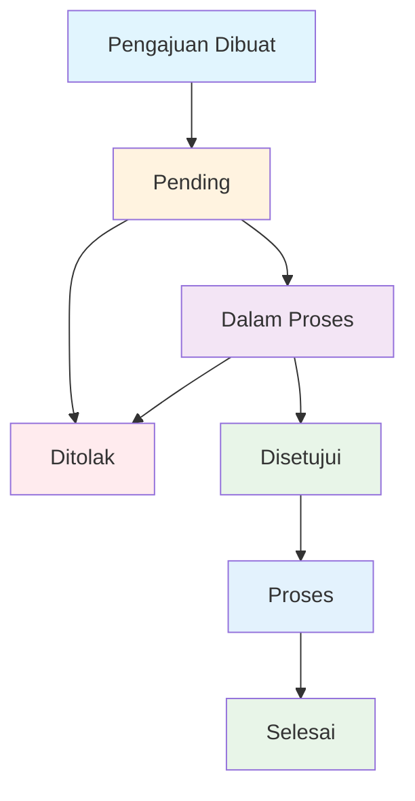

# 📋 Dokumentasi Fitur Pengajuan KTA (Kartu Tanda Anggota)

## 📖 Deskripsi

Fitur Pengajuan KTA memungkinkan karyawan untuk mengajukan pembuatan, penggantian, atau pengurusan KTA yang hilang melalui sistem digital. Admin/HRD dapat mengelola dan memproses pengajuan tersebut.

## 🗂️ Struktur Database

### Tabel: `pengajuan_kta`

| Field               | Type                                                                    | Description                     |
| ------------------- | ----------------------------------------------------------------------- | ------------------------------- |
| `id`                | int(11) AUTO_INCREMENT                                                  | Primary key                     |
| `nik`               | varchar(20)                                                             | NIK karyawan (Foreign Key)      |
| `nama_lengkap`      | varchar(255)                                                            | Nama lengkap karyawan           |
| `jabatan`           | varchar(100)                                                            | Jabatan karyawan                |
| `unit_kerja`        | varchar(100)                                                            | Unit kerja karyawan             |
| `jenis`             | enum('Baru','Ganti','Hilang')                                           | Jenis pengajuan                 |
| `alasan`            | text                                                                    | Alasan pengajuan                |
| `status`            | enum('pending','dalam_proses','disetujui','ditolak','proses','selesai') | Status pengajuan                |
| `alasan_ditolak`    | text                                                                    | Alasan penolakan (jika ditolak) |
| `foto_profile`      | text                                                                    | Path foto profil                |
| `tanggal_bergabung` | date                                                                    | Tanggal bergabung karyawan      |
| `nomor_kta`         | varchar(50)                                                             | Nomor KTA yang diterbitkan      |
| `tanggal_disetujui` | datetime                                                                | Tanggal disetujui               |
| `tanggal_selesai`   | datetime                                                                | Tanggal selesai                 |
| `keterangan`        | text                                                                    | Keterangan tambahan             |
| `created_at`        | timestamp                                                               | Tanggal dibuat                  |
| `updated_at`        | timestamp                                                               | Tanggal diupdate                |

### Analisis Struktur Tabel

#### ✅ Kelebihan:

- **Primary Key**: `id` dengan auto_increment
- **Foreign Key**: `nik` untuk referensi ke tabel pegawai
- **Enum Status**: Menggunakan enum untuk kontrol status
- **Audit Trail**: Timestamp untuk created_at dan updated_at
- **Feedback System**: Field `alasan_ditolak` untuk komunikasi

#### ⚠️ Perbaikan yang Diimplementasikan:

1. **Foreign Key Constraint**: Menambahkan constraint untuk data integrity
2. **Additional Fields**: Menambahkan field yang diperlukan untuk KTA
3. **Index Optimization**: Menambahkan index untuk performa query
4. **Data Validation**: Constraint untuk validasi jenis pengajuan
5. **Triggers**: Auto-populate data dan timestamp management
6. **Views & Procedures**: Untuk reporting dan statistik

## 🔧 Implementasi Teknis

### Backend API (`/api/pengajuan-kta/route.js`)

#### Endpoints:

- **GET**: Mengambil data pengajuan KTA
- **POST**: Membuat pengajuan baru
- **PUT**: Update status pengajuan (Admin/HRD only)

#### Fitur Keamanan:

- JWT Authentication
- Role-based access control
- Input validation
- SQL injection protection

#### Business Logic:

- Validasi pengajuan ganda
- Auto-populate data pegawai
- Status workflow management

### Frontend (`/dashboard/pengajuan-kta/page.js`)

#### Komponen Utama:

- **Form Pengajuan**: Untuk karyawan submit pengajuan
- **Tabel Data**: Menampilkan daftar pengajuan
- **Dialog Update**: Untuk admin/HRD update status
- **Status Badges**: Visual indicator status

#### Responsive Design:

- Mobile-friendly interface
- Optimized untuk berbagai ukuran layar
- Touch-friendly controls

## 🚀 Cara Penggunaan

### Untuk Karyawan:

1. Login ke dashboard
2. Klik menu "Pengajuan KTA"
3. Klik tombol "Ajukan KTA"
4. Pilih jenis pengajuan (Baru/Ganti/Hilang)
5. Isi alasan pengajuan
6. Submit pengajuan
7. Monitor status pengajuan

### Untuk Admin/HRD:

1. Login ke dashboard
2. Akses menu "Pengajuan KTA"
3. Lihat semua pengajuan karyawan
4. Klik tombol "Edit" untuk update status
5. Pilih status baru
6. Isi alasan jika menolak
7. Save perubahan

## 📊 Status Workflow

## 🎨 UI/UX Features

### Visual Elements:

- **Status Badges**: Color-coded untuk mudah dibaca
- **Jenis Badges**: Membedakan jenis pengajuan
- **Icons**: Lucide icons untuk konsistensi
- **Loading States**: Smooth loading experience

### Responsive Features:

- **Mobile Navigation**: Bottom navigation untuk mobile
- **Sidebar Menu**: Desktop navigation
- **Adaptive Layout**: Menyesuaikan ukuran layar

## 🔒 Security Features

### Authentication:

- JWT token validation
- Role-based access control
- Session management

### Data Protection:

- Input sanitization
- SQL injection prevention
- XSS protection

### Access Control:

- Karyawan: Hanya bisa lihat pengajuan sendiri
- Admin/HRD: Bisa lihat dan mengelola semua pengajuan

## 📈 Performance Optimization

### Database:

- **Indexes**: Pada field yang sering di-query
- **Foreign Keys**: Untuk data integrity
- **Views**: Untuk complex queries
- **Procedures**: Untuk statistik

### Frontend:

- **Lazy Loading**: Components dimuat sesuai kebutuhan
- **State Management**: Efficient state updates
- **Error Handling**: Graceful error management

## 🧪 Testing

### Unit Tests:

- API endpoint testing
- Database operations
- Business logic validation

### Integration Tests:

- End-to-end workflow
- User role permissions
- Data consistency

### UI Tests:

- Form validation
- Responsive design
- User interactions

## 📋 Maintenance

### Regular Tasks:

- Monitor pengajuan pending
- Cleanup data lama
- Performance monitoring
- Security updates

### Backup Strategy:

- Regular database backup
- Version control
- Rollback procedures

## 🔄 Future Enhancements

### Planned Features:

1. **Email Notifications**: Notifikasi status change
2. **File Upload**: Upload dokumen pendukung
3. **Bulk Operations**: Proses multiple pengajuan
4. **Advanced Reporting**: Dashboard analytics
5. **Mobile App**: Dedicated mobile application

### Technical Improvements:

1. **Caching**: Redis untuk performance
2. **Queue System**: Background processing
3. **Microservices**: Service separation
4. **API Versioning**: Backward compatibility

## 🆘 Troubleshooting

### Common Issues:

#### 1. Pengajuan Tidak Bisa Dibuat

- **Penyebab**: Ada pengajuan aktif
- **Solusi**: Tunggu pengajuan sebelumnya selesai

#### 2. Data Tidak Muncul

- **Penyebab**: Permission atau network issue
- **Solusi**: Check authentication dan koneksi

#### 3. Status Tidak Bisa Diupdate

- **Penyebab**: Insufficient permissions
- **Solusi**: Pastikan user memiliki role admin/HRD

### Error Codes:

- `400`: Bad Request - Invalid input
- `401`: Unauthorized - Authentication required
- `403`: Forbidden - Insufficient permissions
- `404`: Not Found - Data tidak ditemukan
- `500`: Internal Server Error - Server issue

## 📞 Support

Untuk bantuan teknis atau pertanyaan, hubungi:

- **Developer**: [Your Contact]
- **System Admin**: [Admin Contact]
- **HRD**: [HRD Contact]

---

**Tanggal Dibuat**: [Current Date]
**Versi**: 1.0
**Status**: Active
